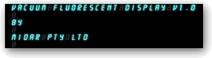



## A Vacuum Fluorescent Display Simulator v1\.0

### Description

This is a small application designed to mimick the look of Vacuum Fluorescent Displays (VFD). Use my VFD print method to enhance the look and feel of your next sci-fi game.
 
### More Info
 

             |
---                |---
**Submitted On**   |2003-02-02 06:23:04
**By**             |[Peter Wilson](https://github.com/Planet-Source-Code/PSCIndex/blob/master/ByAuthor/peter-wilson.md)
**Level**          |Beginner
**User Rating**    |4.8 (43 globes from 9 users)
**Compatibility**  |VB 6\.0
**Category**       |[Graphics](https://github.com/Planet-Source-Code/PSCIndex/blob/master/ByCategory/graphics__1-46.md)
**World**          |[Visual Basic](https://github.com/Planet-Source-Code/PSCIndex/blob/master/ByWorld/visual-basic.md)
**Archive File**   |[A\_Vacuum\_F153804222003\.zip](https://github.com/Planet-Source-Code/peter-wilson-a-vacuum-fluorescent-display-simulator-v1-0__1-42881/archive/master.zip)

